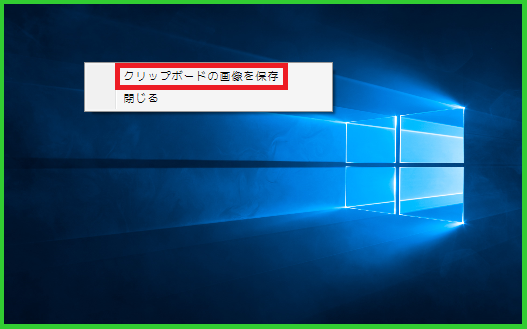

# ImageForClipboard

クリップボードの画像を操作するソフトです。
画像の表示、保存、クリップボードにコピーを行うことが出来ます。

## 使い方

#### クリップボード内の画像の表示
クリップボードに画像が存在する時、「ImageForClipboard.exe」を実行することでクリップボードの画像を見ることができます。PrintScreenの機能でコピーした画像などの確認ができます。
クリップボード内に画像が存在しない時はなにもしません。
※緑色の枠内にコピーしている画像が表示されます。

#### クリップボード内の画像をコピーする
クリップボード内の画像が表示さているウィンドウを右クリック後、「クリップボードの画像を保存」メニューを選択することが保存ダイアログが表示されクリップボード内の画像を保存することができます。
※対応拡張子は「bmp、png、gif、jpg」になります

#### ウィンドウの閉じ方
クリップボード内の画像が表示さているウィンドウを右クリック後、「閉じる」メニューを選択することでウィンドウを閉じることができます

## コマンドモード
ImageForClipboardをコマンドラインから実行するためのコマンドがあります。  

#### /?（ヘルプ）
コマンドの一覧を表示します。

#### /AutoClose（ウィンドウを自動で閉じる）
ウィンドウを表示後、自動で閉じる時間（秒）を指定できます
例：/AutoClose 5　５秒後にウィンドウが自動で閉じる

#### /Copy（画像をクリップボードへコピー）
画像パスを指定することでその画像をクリップボードへコピーします。画像が存在しない場合はエラーが表示されます。
例：/Copy C:\test.png

#### /AutoSave（画像を自動保存する）
指定したディレクトリにクリップボード内の画像を保存します。保存されるファイル名は「西暦月日時間分秒＋拡張子」となります。
保存ファイル名例：20170914121011.bmp
例：/AutoSave C:\test

#### /DoNotShow（ウィンドウを表示しない）
起動した時、ウィンドウを表示させません。画像を自動保存する時に併用して下さい。
例：/DoNotShow

#### /Extension（出力画像拡張子）
画像を自動保存するときの拡張子を指定できます。
対応している拡張子：bmp,png,gif,jpg
何も指定していない場合は「bmp」となります。
例：/Extension jpg
 
#### /ImageSize（表示画像サイズ）
表示する画像のサイズを指定することができます（1～100）
例：/ImageSize 40 ４０％の大きさで画像を表示

## 送るフォルダにImageForClipBoardを登録  

「CreateCommandModeLinks.vbs」を実行することで「送る」フォルダにImageForClipBoardのコマンドモード  
処理を登録することが出来ます。登録される処理は以下のとおりです。 

#### 選択されている画像をコピー
ImageForClipboard.exeのパス /ImageSize 25 /AutoClose 1 /Copy
※エクスプローラーで選択している画像を２５％の大きさで１秒間表示しクリップボードにコピーします。

## 修正履歴

### Ver.1.0.0
・初回リリース